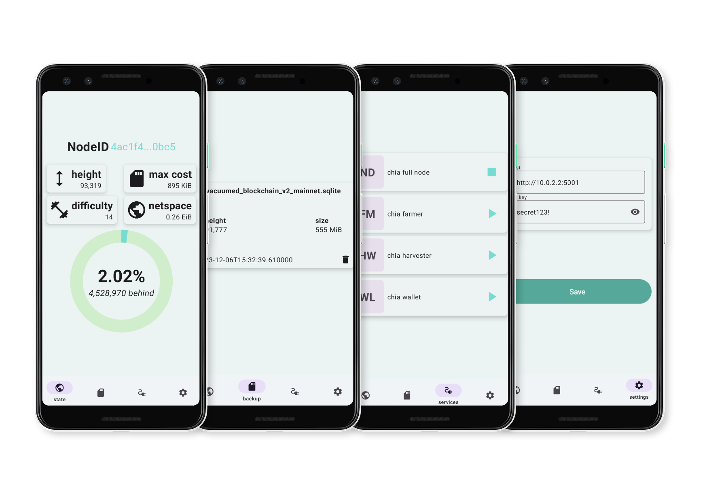

# ChiaMonitor

ChiaMonitor is a full-stack Android application designed to monitor various
data related to a Chia node and to make backups for the blockchain database.

## Technologies utilized

The app is developed using Jetpack Compose, Dagger Hilt, the Paging Library, and Retrofit, while the backend is implemented in Python with Flask.

## Prerequisites

### Chia blockchain

`chia-rest` is designed to expose metrics from a Chia node. To use the
application, you'll need a running instance of the node. I recommend installing
it from [soruce](https://docs.chia.net/installation/#from-source).

### Python

`chia-rest` is written in Python so in order to use it you will need it. It uses the latest version which is currently `3.12.0`.

I recommend using a Python virtual environment for installing it and all the dependencies. I usually go with [`pyenv`](https://github.com/pyenv/pyenv) paired with [`pyenv-virtualenv`](https://github.com/pyenv/pyenv-virtualenv).

#### Install Python with pyenv

With `pyenv` and `pyenv-virtualenv` installed you can execute the following commands:

```
pyenv install 3.12.0

# create a virtual environment for packages
pyenv virtualenv 3.12.0 chiarest3120

# set the environment as local environment for chia-rest
# navigate to the /chia-rest folder
pyenv local chiarest3120 
```

#### Install packages

With all that settled you are ready to install the package requirements for `chia-rest`.

```
# navigate to the /chia-rest folder
pip install -r requirements.txt
```

### Environmental variables

`chia-rest` requires some environmental variables.
Here is a sample of that.

```
# required variables
CHIA_APP_ROOT={root of you chia-blockchain app eq. .../chia-blockchain}
API_KEY={secret key}

# optional variables with their default values
BACKUP_PATH=$HOME/.chia/mainnet/db/vacuumed_blockchain_v2_mainnet.sqlite
CHIA_ROOT='$HOME/.chia/mainnet'
RPC_ROOT=http://localhost
```

Copy these lines into your `.env` and set the required variables to the appropriate values.
The file has to be made at the root of the `chia-rest` app.

### Android Studio

Android Studio is needed for running the application inside of a simulator. Import the `ChiaMonitor` project via `OPEN` > `.../ChiaMonitor`.

## Starting the server

First you need to start the `chia-blockchain`

```
# navigate to the /chia-blockchain folder
. ./activate
chia start node
```

After that you can start the `chia-rest` server.

```
# navigate to the /chia-rest folder
python chia_rest.py
```

## Starting the app

You can start the app in a simulator. The required API is 33 or above.

### Host

The host should be `http://10.0.2.2:5001` which is a virtual route for your machines loopback interface.


### Api key

The api key should match the one you defined in your `.env` file.


## Aditional thoughts

In some cases the blockchain database can be corrupted. Simply delete the files
from the `.chia/mainnet/db` folder and the node should make a new one.

A freshly started needs some time to find the initial block for its database.
No data on the blockchain state screen considered as normal in this scenario.
